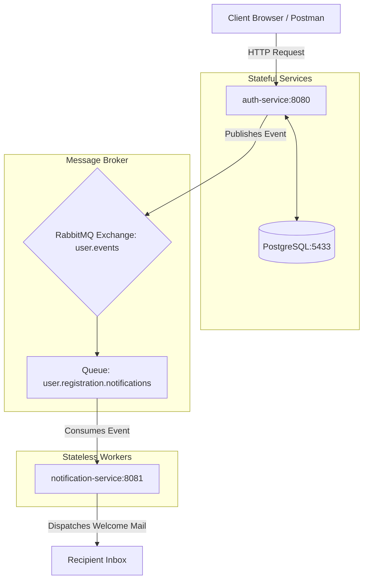

# Distributed Auth & Asynchronous Messaging Ecosystem

This project is multi-service ecosystem designed using a microservices-inspired pattern with **Java 23**, **Spring Boot 3.5.x**, **PostgreSQL**, and **RabbitMQ**. It implements secure token-based user authentication and decoupled asynchronous notification delivery.

---

## 🏗️ Architectural Topology

The ecosystem is built from the ground up using a decoupled asynchronous communication model:



---

## 📂 Project Directory Structure

```text
auth-notifier-ms
├── auth-service                 # Stateful authentication service
│   ├── src/main/java            # Java source files (Security, Entities, DTOs, Repos)
│   ├── src/main/resources       # application.properties and db/migration/ scripts
│   └── pom.xml                  # Service dependencies (Spring Security, JPA, AMQP, Flyway)
├── notification-service         # Stateless background notification worker
│   ├── src/main/java            # Java source files (Consumers, Dtos, EmailService)
│   ├── src/main/resources       # application.properties configuration
│   └── pom.xml                  # Service dependencies (Spring AMQP, Spring Mail, Lombok)
├── docker-compose.yml           # Database and Broker container specifications
├── .env                         # Real secret configurations (Git ignored)
├── example.env                  # Environment template for configurations
├── openapi.yaml                 # Complete Swagger / OpenAPI API spec file
└── README.md                    # Root architectural documentation
```

---

## ⚙️ Prerequisites

To run and build this ecosystem locally, ensure you have:
* **Java SDK**: Version `23` (or higher)
* **Build System**: Maven (wrapped via `./mvnw`)
* **Container Runtime**: Docker and Docker Compose installed and running
* **SMTP Provider**: Access to an SMTP credentials system (Gmail App Password, Resend, or SendGrid) for testing real email delivery.

---

## 🚀 Infrastructure & Getting Started

### 1. Clone the Repository
Clone the project repository to your local machine:
```bash
git clone https://github.com/murilodcosta/auth-notifier-ms.git
cd auth-notifier-ms
```

### 2. Initialize Supporting Containers
Spin up the required database and message broker services in detached mode from the root directory:
```bash
docker-compose up -d
```

* **PostgreSQL Database**: Accessible locally on port `5433` (DB: `auth_db`, user: `postgres`, pass: `postgres_password`).
* **RabbitMQ Broker**: AMQP listener on port `5672`, and the **Management Web Console** dashboard on [http://localhost:15672](http://localhost:15672) (credentials: `guest`/`guest`).

### 3. Configure Environment Secrets
Copy the template environment configurations file and fill in your actual SMTP/CloudAMQP variables:
```bash
cp example.env .env
```
*(Note: `.env` is secure and ignored by git).*

### 4. Compile and Run the Services
Open two separate terminals:

* **Terminal 1: Start `auth-service` (Port `8080`)**
  ```bash
  cd auth-service
  # Build and run with environment variables loaded
  ./mvnw spring-boot:run
  ```
  *Flyway will validate and run schema migrations in the Postgres container automatically.*

* **Terminal 2: Start `notification-service` (Port `8081`)**
  ```bash
  cd notification-service
  # Build and run with environment variables loaded
  ./mvnw spring-boot:run
  ```

---

## 🔌 API Reference & Swagger UI Documentation

All endpoints are prefix-mapped to `/v1`. Authentication uses the standard `Bearer JWT` token mechanism.

### Key Authentication Endpoints
* **`POST /v1/auth/register?role={USER|ADMIN}`**  
  Registers a new user account.
* **`POST /v1/auth/login`**  
  Authenticates credentials and returns a JWT token.
* **`GET /v1/users/me`** (Secured)  
  Retrieves profile information for the authenticated token.
* **`GET /v1/users`** (Admin Only)  
  Retrieves a paginated list of all registered users.

### 📖 How to view the Swagger / OpenAPI Documentation
The full, interactive API contracts are defined in [openapi.yaml](openapi.yaml). You can visualize and test them using any of the following methods:

1. **Local Swagger UI**:
   * Start `auth-service` locally using `./mvnw spring-boot:run`.
   * Open your browser and navigate to **[http://localhost:8080/swagger-ui/index.html](http://localhost:8080/swagger-ui/index.html)**.
   * You can test the endpoints directly from the browser!
2. **Swagger Editor**:
   * Copy the contents of [openapi.yaml](openapi.yaml).
   * Paste it into the online [Swagger Editor](https://editor.swagger.io) to view the interactive UI, documentation, and mock examples.
3. **Postman**:
   * Open Postman.
   * Click **Import** and select the [openapi.yaml](openapi.yaml) file.
   * Postman will automatically generate a fully structured request collection.
4. **IDE Plugins**:
   * **IntelliJ IDEA**: Install the *OpenAPI Specifications* plugin to get a live preview window.
   * **VS Code**: Install the *Swagger Viewer* plugin and press `Alt + Shift + P` to visualize.

---

## 🧩 Decoupled Architecture Design

Our architecture splits transactional business logic from worker processes to ensure maximum scalability and resilience:

| Feature Dimension | `auth-service` | `notification-service` |
| :--- | :--- | :--- |
| **State Nature** | **Stateful** (Tightly bound to Postgres DB) | **Stateless** (No database connection) |
| **Communication Role**| **Producer** (Publishes user.registered events) | **Consumer** (Listens to RabbitMQ queues) |
| **Scaling Strategy** | Scales horizontally for high REST traffic | Scales workers dynamically for queue backlogs |
| **Resiliency Impact** | Remains fully operational even if Mailer is down | Retries failed emails without halting registrations |

### How Asynchronous Resiliency Works:
When a user registers:
1. `auth-service` writes to Postgres, emits a JSON message to RabbitMQ's exchange (`user.events`), and returns `200 OK` to the client instantly.
2. If `notification-service` is down or the SMTP provider has an outage, the messages are not lost. They are buffered securely inside RabbitMQ's persistent queue (`user.registration.notifications`).
3. As soon as `notification-service` recovers, it consumes the queued backlogs and dispatches the emails sequentially, preventing data loss.